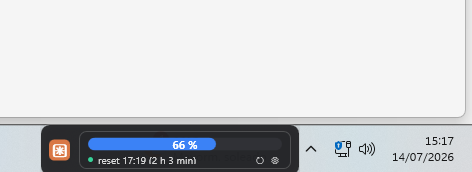
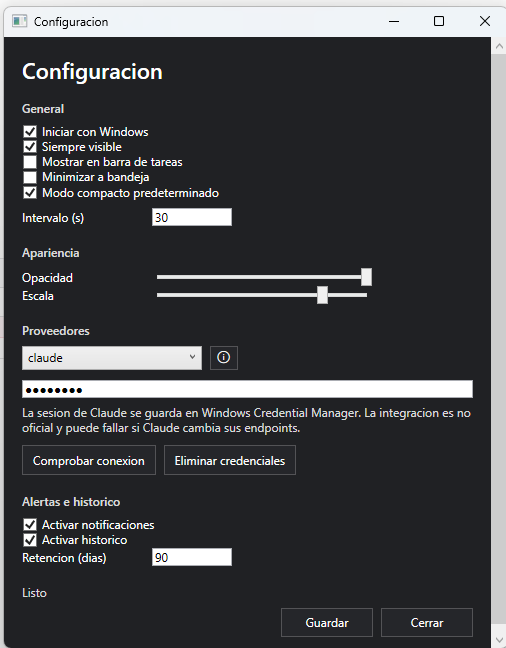

# AI Usage Widget

AI Usage Widget is a native Windows desktop widget for monitoring AI provider usage in a compact, always-on-top interface. It is built with C#, .NET 8, WPF and MVVM, stores data locally without a database, and protects sensitive provider credentials with Windows security mechanisms.

## Screenshots





## Repository Description

```text
Native Windows 11-style WPF widget for monitoring AI usage limits, starting with Claude and a safe demo provider. Built with .NET 8, MVVM, local JSON storage and Windows Credential Manager.
```

## Features

- Compact floating widget inspired by Windows 11 taskbar widgets.
- Expanded view with provider details and local history.
- Demo provider for running the app without credentials.
- Claude provider isolated behind a non-official integration.
- Local settings and history stored as JSON files.
- Sensitive credentials stored outside JSON using Windows Credential Manager.
- System tray icon with quick actions.
- Configurable refresh interval, opacity, scale, notifications and startup behavior.
- No database, no external server, no telemetry.

## Requirements

- Windows 10/11.
- Visual Studio 2022 with the .NET Desktop Development workload.
- .NET 8 SDK.
- WebView2 Runtime for the Claude browser fallback.

## Build

```powershell
dotnet restore AIUsageWidget.sln
dotnet build AIUsageWidget.sln
dotnet test AIUsageWidget.sln
```

## Publish

```powershell
dotnet publish src\AIUsageWidget.App\AIUsageWidget.App.csproj -c Release -r win-x64 --self-contained false -o publish\win-x64
```

The executable will be created at:

```text
publish\win-x64\AIUsageWidget.App.exe
```

## Installer

The project includes two installer paths:

- `scripts\Build-IExpressInstaller.ps1`: builds a basic Windows self-extracting installer using `iexpress.exe`.
- `installer\AIUsageWidget.iss`: Inno Setup script for a more conventional desktop installer.

Generate the IExpress installer:

```powershell
.\scripts\Build-IExpressInstaller.ps1
```

Output:

```text
artifacts\installer\AIUsageWidget-Setup.exe
```

## Project Structure

- `src/AIUsageWidget.App`: WPF UI, ViewModels, tray icon, windows and application services.
- `src/AIUsageWidget.Core`: models, interfaces, provider contracts and business rules.
- `src/AIUsageWidget.Infrastructure`: local JSON storage, atomic writes, Credential Manager, logging and Windows startup.
- `src/AIUsageWidget.Providers`: Demo and Claude provider implementations.
- `tests`: unit tests without real provider accounts.

## Local Data

Runtime data is stored under:

```text
%LOCALAPPDATA%\AIUsageWidget\
```

Typical files:

```text
settings.json
notifications.json
history\
logs\
```

Credentials are not stored in those JSON files. Provider secrets are stored through Windows Credential Manager.

## Claude Integration

Claude currently does not provide a stable official usage API for this widget. The Claude provider uses isolated, defensive calls to Claude web endpoints and may break if Claude changes its internal API or authentication behavior.

The app never sends Claude credentials to a custom server. The session value is stored locally in Windows Credential Manager and is not written to logs.

If Claude returns an unsupported format, blocks the request, or the session expires, the UI reports that the usage data is unavailable or that login is required again.

## Adding a Provider

1. Implement `IUsageProvider` in `AIUsageWidget.Providers`.
2. Return a `UsageSnapshot`; use `null` for unavailable fields.
3. Register the provider in `AIUsageWidget.Providers/DependencyInjection.cs`.
4. Add mapping tests with simulated responses.
5. Do not log tokens, cookies, API keys or full authentication headers.

## Security Notes

- Do not commit `settings.json`, logs, history files, `.env` files, certificates or published binaries.
- Do not commit provider session keys, cookies, tokens or API keys.
- Keep GitHub secret scanning enabled if the repository is public.
- Prefer a private repository until you have reviewed the first commit.

## Known Limitations

- Claude support is non-official and may stop working if Claude changes its web endpoints.
- The widget cannot be shown above elevated administrator windows, UAC prompts, exclusive fullscreen apps, or other aggressively topmost windows in all cases.
- The history chart is intentionally lightweight and does not use a heavy charting dependency.
- The tray icon currently uses a basic system icon.
